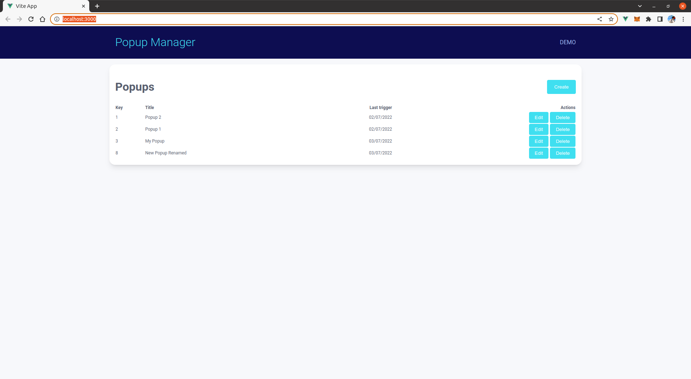
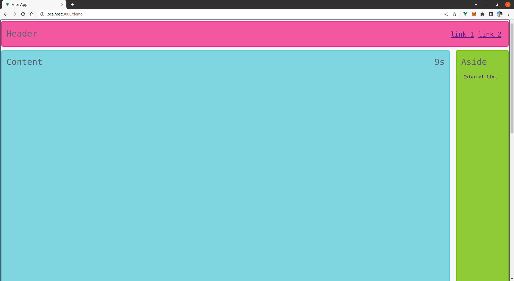

# popup-manager

Vue.js app that manages marketing popups.

## Project Setup
The app was tested with node v16.13

```sh
$ npm install
```

### Compile and Hot-Reload for Development

```sh
$ npm run dev
```

### Compile and Minify for Production

```sh
$ npm run build
```

## Running the app

The app consist of two parts, the popup management app which is responsible from managing the active popups stored in the database and a demo application where the active popups can be tested.

### Popup Management

Create a popups list with the ability to create / edit / delete popups.
This tool uses the [IndexedDb API](https://developer.mozilla.org/en-US/docs/Web/API/IndexedDB_API) to store the popups in the browser and comes with 2 predefined popups as an example.



### Demo Application

This application tries to emulate a web page with some basic functionalities that will help testing the active popups.

